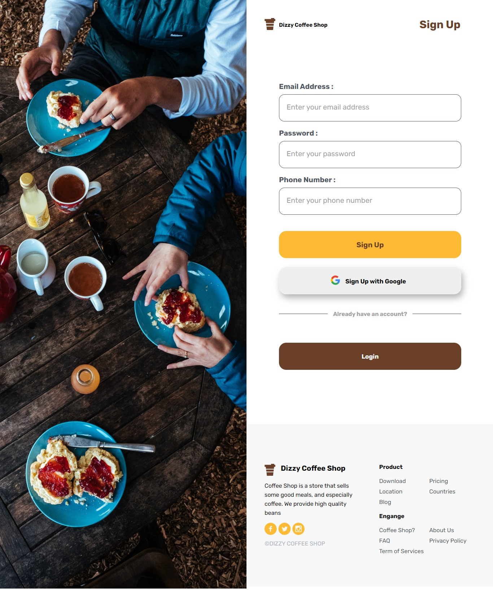
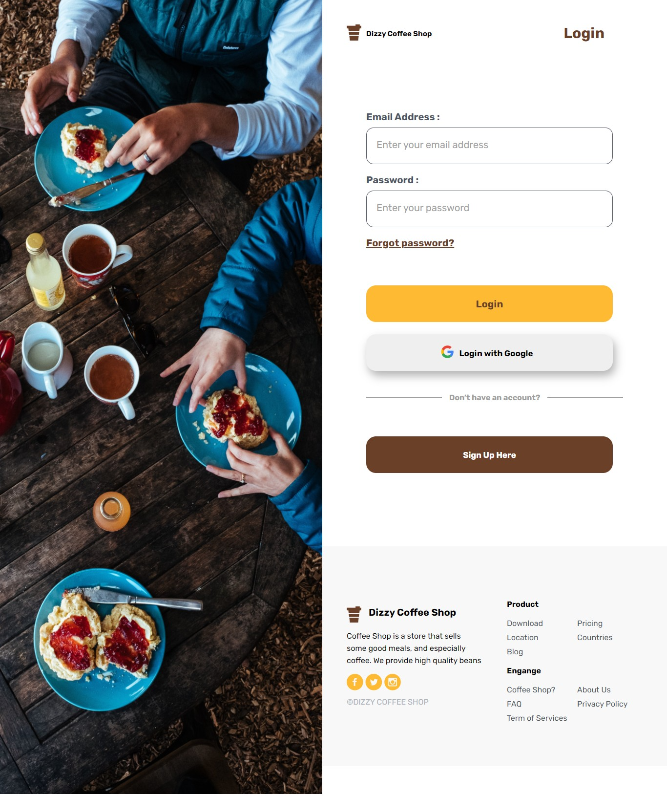
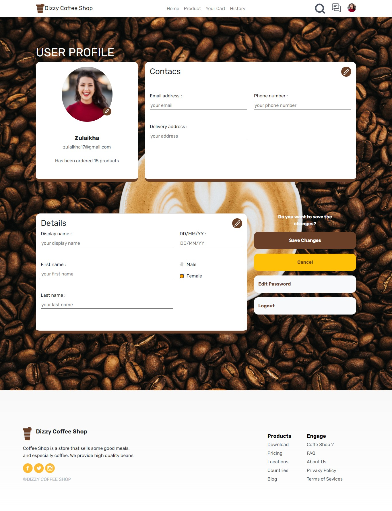
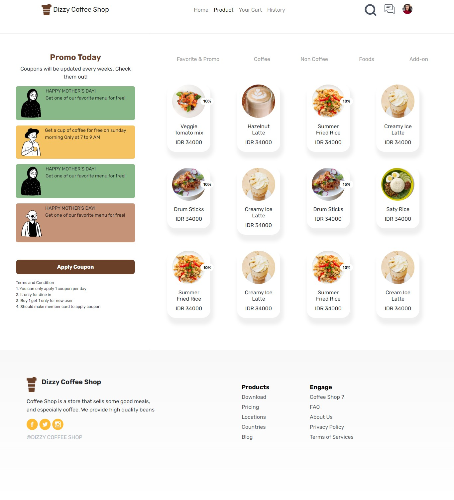
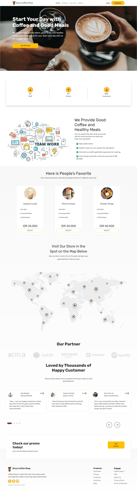

<h1 align="center">WEB RESPONSIVE</h1>

<div align="center">
  <h1>DIZZY COFFEE SHOP</h1>
</div>

## Built with 🧰


<br>

## How to run the project?
1. Clone the repository
   ```
   $ git clone https://github.com/faryadicka/WEB-RESPONSIVE.git
   ```
2. Open [VS Code](https://code.visualstudio.com/)
3. Install [Live Server Extension for VS Code](https://marketplace.visualstudio.com/items?itemName=ritwickdey.LiveServer)
4. Right click _index.html_ then choose **Open With Live Server**

## Preview Project :

<div style='display:flex;row-gap:10px;column-gap:15px;align-items:center;'>
  
  
  
  
  
</div>

<br>

## RELATED PROJECT

* [`Backend-DizzyCoffeeShop`](https://github.com/faryadicka/DIZZY-COFFEE-BACKEND)

## MY CONTACT

Email : faryadicka98@gmail.com
